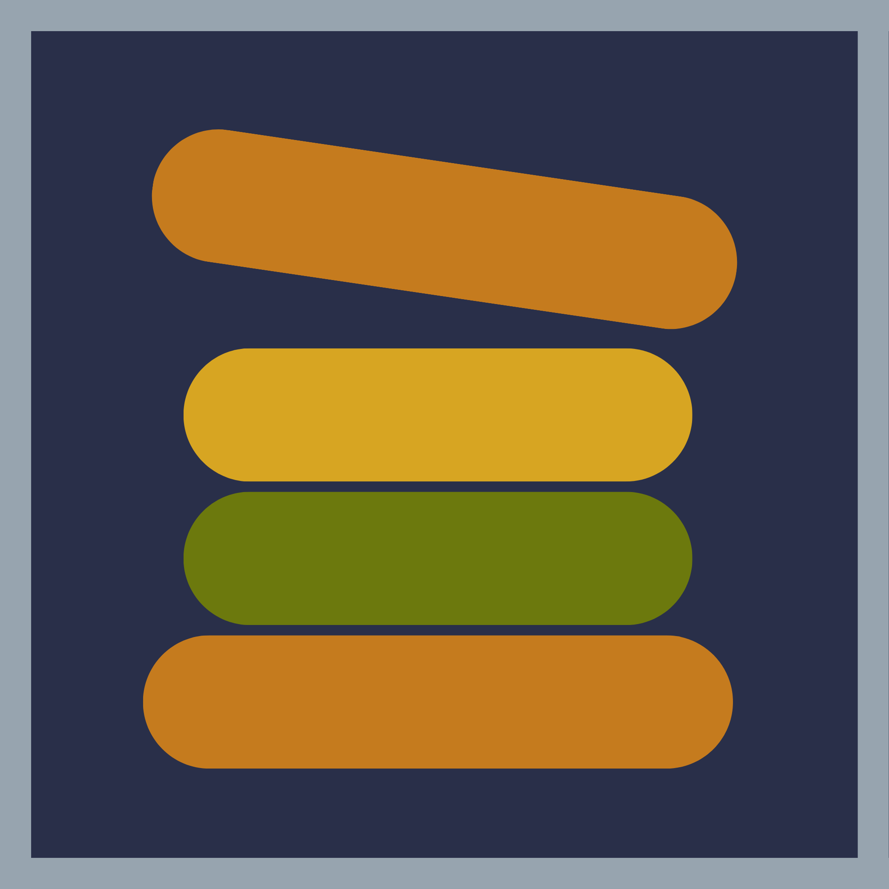

<div align="center">
  

  # Ochre

</div>
<br>

**Ochre** (pronounced *Oak-er*) is a simple, semi-low-level stack programming language built on a single core principle: **all manipulation stays on the stack.**
It draws inspiration from Assembly, modernizing and pruning its features for use in a pure stack-based environment.


## Features

*   **Stack-Centric:** All manipulation happens directly on the stack.
*   **Variables:** Control important instances while maintaining the stack-based architecture.
*   **Precise Control Flow:** Tighter control flow utilizing labels and conditional jump statements.
*   **Complex Types:** Support for complex data types backed by strict type-checking.
*   **Heap Allocation:** Create heap-allocated struct instances that can be passed around on the stack.
*   **Naming Freedom:** Extensive flexibility for naming conventions.

## Quick Start

### Prerequisites

Ensure you have the following installed on your Linux system:
*   A C++ compiler (configured for `clang++` by default)
*   [GNU Make](https://www.gnu.org/software/make/)
*   [Flat Assembler 1 (FASM)](https://flatassembler.net/)

### Installation

Once dependencies are met, install Ochre to your PATH with a single command:

```bash
sudo make install
```

You can now run `ochre` from anywhere on your system.

### Testing

Verify your installation by running the built-in test suite:

```bash
make test
```

## Usage

```bash
Usage: ochre [options] <input_file>

Options:
    -h, --help    Display this information
    -o <file>     Place the output into <file> (default: a.out)
    --asm <file>  Output assembly code to <file> (default: /tmp/out.asm)
```
